| Synerex Alpha環境 Go言語インストール手順書 |
| ------------------------------------------ |
| **（Windows編）**                          |
| **R0.07版**                                |

| 作成者     | 榊原          |
| ---------- | ------------- |
| 初版作成日 | 2019年4月26日 |
| 最終更新日 | 2019年5月14日 |

 目次

[TOC]

# はじめに

 本書はGo言語インストールに関する手順書である。Synerex Alphaが実行できる環境の構築を目的としているため、gRPCなど関連モジュールの記述も含んでいる。

 モジュールインストール毎に正常確認を行うために、環境変数を取込むWindows再起動を都度行う手順としている。

# 前提条件

-  Windows 7以降（本書はWindows 10で説明）
- 管理者権限ユーザ
- 文中の「\」（バックスラッシュ）、「￥」（円マーク）は同一文字として読み替えのこと


## セットアップ順序

 セットアップ順序は以下のとおりである。

1. Gitのインストール
2. Goのインストール
3. gRPCのインストール
4. Protocol Buffersのインストール
5. Node.jsとNPMのインストール
6. YARNのインストール
7. 関連パッケージのインストール


# 事前確認

 作業前に以下を確認する。

## OS情報の確認

 ［Win］キー（or ［スタート］） → ｓ ｙ ｓ入力 → システム
 選択で以下画面を表示、Windowのbitを確認する。


# Gitのインストール

 Git（ギット）は、プログラムのソースコードなどの変更履歴を記録・追跡するための分散型バージョン管理システムである。

 Gitでは、各ユーザのワーキングディレクトリに、全履歴を含んだリポジトリの完全な複製が作られる。したがって、ネットワークにアクセスできないなどの理由で中心リポジトリにアクセスできない環境でも、履歴の調査や変更の記録といったほとんどの作業を行うことができる。

## Gitインストール済み確認

 ［Win］キー（or ［スタート］） → ｃ ｍ ｄ入力 → コマンドプロンプト 
 選択しコマンドプロンプト画面を表示する。

 ※以降、コマンドプロンプト表示方法は省略

 コマンドプロンプトから以下のコマンドを実行し、バージョンが正しく表示されることを確認する。

```
> git --version
```

 バージョン表示で失敗する場合、以下インストールを実施する。

## Gitインストール

 Git未インストール時に以下を実施する。

### インストーラの準備

 公式サイト（URL: [https://git-scm.com/](https://git-scm.com/)）よりインストーラのダウンロードを行う。

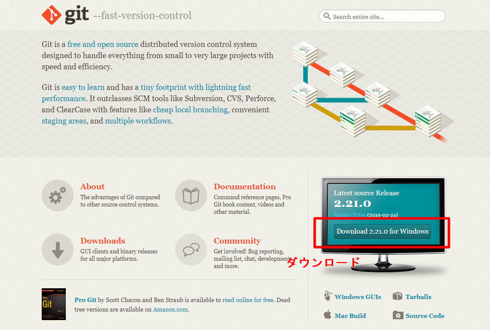

### インストーラ実行

 ダウンロードしたインストーラを実行する。


-  ［Next］押下


以降省略。デフォルトのまま、［Next］押下

-  インストール完了後、［Finish］押下


### 再起動とバージョン確認

 インストールに伴い必要な環境変数が定義されるのでWindowsを再起動後、前項「Gitインストール済み確認」に従い、バージョンが正しく表示されることを確認する。


# Goのインストール

 Goはプログラミング言語の1つである。2009年、GoogleでRobert Griesemer、ロブ・パイク、ケン・トンプソンによって設計された。

 Goは、静的型付け、C言語の伝統に則ったコンパイル言語、メモリ安全性（英語版）、ガベージコレクション、構造的型付け（英語版）、CSPスタイルの並行性などの特徴を持つ。Goのコンパイラ、ツール、およびソースコードは、すべてフリーかつオープンソースである。

## ディレクトリ構成

 Go環境の基本的なディレクトリ構成を以下に示す。

| #    | 名称                   | 環境変数名 | パス                | 備考                     |
| ---- | ---------------------- | ---------- | ------------------- | ------------------------ |
| 1    | Go本体                 | GOROOT     | c:\Go               |                          |
| 2    | Go関連モジュール       | GOPATH     | %USERPROFILE%\go  ※ | リンクモジュール格納先   |
| 3    | Goプロジェクトフォルダ | ー         | c:\MyProjects    ※  | ユーザプロジェクト作業先 |

※任意

## Goインストール済み確認

 コマンドプロンプトから以下のコマンドを実行し、バージョンが正しく表示されることを確認する。

```
> go version
```

 バージョン表示で失敗する場合、以下インストールを実施する。

## Goインストール

 Go未インストール時に以下を実施する。

### インストーラの準備

 公式サイト（URL: [https://golang.org/dl/](https://golang.org/dl/)）より該当するWindows用インストーラ（.msi）をダウンロードする。


### インストーラ実行

 ダウンロードしたインストーラを実行する。


-  ［Next］押下


- 「Ｉ accept･･･」にチェックを入れた後、［Next］押下


-  インストール先を確認し、［Next］押下


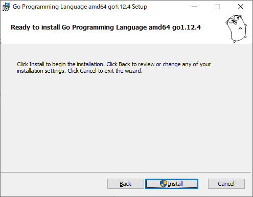

-  ［Install］押下


-  インストール途中に「Google LLC」のインストールを許可しますか？をきいてくるの「はい」押下


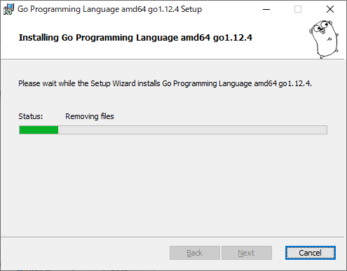

-  しばらく待つ


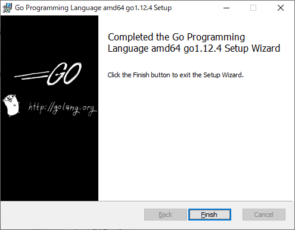

-  ［Finish］押下


### 再起動とバージョン確認

 インストールに伴い必要な環境変数が定義されるのでWindowsを再起動後、前項「Goインストール済み確認」に従い、バージョンが正しく表示されることを確認する。


# gRPCのインストール

 gRPCは、RPC (Remote Procedure Call)を実現するためにGoogleが開発したプロトコルの1つである。
 Protocol Buffersを使ってデータをシリアライズし、高速な通信を実現できる点が特長である。
 gRPCでは、IDL（インターフェース定義言語）を使ってあらかじめAPI仕様を.protoファイルとして定義し、そこからサーバー側＆クライアント側に必要なソースコードのひな形を生成する。
 言語に依存しないIDLで先にインタフェースを定義することで、様々なプログラミング言語の実装を生成できるというメリットがある。

## gRPCインストール済み確認

 以下いずれかのフォルダ内に「genproto＊」「grpc＊」フォルダがあればOK。
 （「%GOPATH%」では正常に動作しないことがあるため「%USERPROFILE%」で確認する。（環境設定値「;」の影響））

 %USERPROFILE%\go\src\google.golang.org         または
 %USERPROFILE%\go\pkg\mod\google.golang.org

 【確認例】

```
> dir %USERPROFILE%\go\src\google.golang.org
> dir %USERPROFILE%\go\pkg\mod\google.golang.org
```

 フォルダが存在しない場合、以下インストールを実施する。

## gRPCインストール

 コマンドプロンプトから以下のコマンドを実行する。

```
> go get -u google.golang.org/grpc
```

 ※処理に数分程度要することがあるので気長に待つ。

 処理終了後、前項「gRPCインストール済み確認」に従い、フォルダがあることを確認する。


# Protocol Buffersのインストール

 Protocol Buffers（プロトコルバッファー）はインタフェース定義言語 (IDL) で構造を定義する通信や永続化での利用を目的としたシリアライズフォーマットであり、Googleにより開発されている。

 オリジナルのGoogle実装はC++、Java、Pythonによるものであり、フリーソフトウェアとしてオープンソースライセンスで公開されている。

 また、ActionScript・C言語・C#・Clojure・Common Lisp・D言語・Erlang・Go・Haskell・JavaScript・Lua・MATLAB・Mercury・Objective-C・OCaml・Perl・PHP・R言語・Ruby・Scala・.NET Frameworkなどの実装が利用可能である。

## Protocol Buffersインストール済み確認

 コマンドプロンプトから以下のコマンドを実行し、バージョンが正しく表示されることを確認する。

```
> protoc --version
```

 バージョン表示で失敗する場合、以下インストールを実施する。

## Protocol Buffersインストール

 Protocol Buffers未インストール時に以下を実施する。

### モジュールのダウンロード

 公式サイト（URL: [https://github.com/protocolbuffers/protobuf/releases](https://github.com/protocolbuffers/protobuf/releases)）より該当するWindows用モジュールをダウンロードする。


### 圧縮ファイルの展開

 ダウンロードしたzipファイルを任意のフォルダに展開する。

 （例：C:\Program Files\Protoc 下）

 展開したbinフォルダ内の実行ファイル（protoc.exe）のみを「%USERPROFILE%\GO\bin」フォルダ下にコピーする手順もあるが、Synerex Alphaでは、「include」部分もビルド時に必要なため以下の手順とする。

### 環境変数の設定

 ［Win］キー（or ［スタート］） → ｅ ｎ ｖ入力 → システム環境変数の編集
 選択で以下画面を表示、環境変数情報を編集する


-  システム環境変数の［新規］押下


- 変数名：「PROTOC_PATH」
- 変数値：圧縮ファイル展開先￥バージョン￥bin
- ［OK］押下


-  「PROTOC_PATH」項目が追加されていることを確認


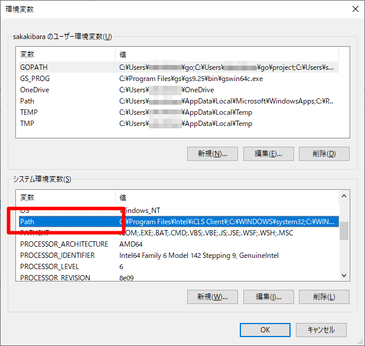

-  システム環境変数の「Path」項目をダブルクリック


1. ［新規］押下
2. 「％PROTOC_PATH%」入力
3. ［OK］押下


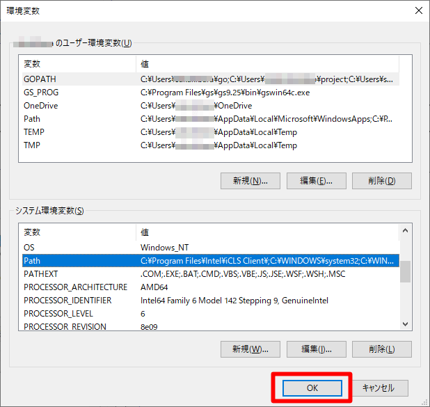

-  ［OK］押下


### 再起動とバージョン確認

 環境変数を定義したためWindowsを再起動後、前項「Protocol Buffersインストール済み確認」に従い、バージョンが正しく表示されることを確認する。

## Protocol BuffersのGo用プラグインの確認とインストール

 コマンドプロンプトから以下のコマンドを実行し、Protocol BuffersのGo用プラグインが存在することを確認する。

```
> where protoc-gen-go
```

 上記コマンドにてファイルが存在しない場合、コマンドプロンプトから以下のコマンドを実行し、Go用プラグインをインストールする。

```
> go get -u github.com/golang/protobuf/protoc-gen-go
```

 ※処理に数分程度要することがあるので気長に待つ。

 処理終了後、上記whereコマンドを実行し、ファイルが存在することを確認する。


# Node.jsとNPMのインストール

 JavaScriptは本来クライアントサイドで動く言語で、HTMLで書かれたページに動きをつけたりするものである。Node.jsはサーバサイドで動くJavaScriptである。

 NPM(Node Package Manager)とは、Node.jsのパッケージを管理するものである。

## Node.jsとNPMインストール済み確認

 コマンドプロンプトから以下のコマンドを実行し、バージョンが正しく表示されることを確認する。

```
> node --version    ← Node.jsの確認
> npm --version     ← NPMの確認
```

 バージョン表示で失敗する場合、以下インストールを実施する。

## Node.jsとNPMインストール

 Node.jsとNPM未インストール時に以下を実施する。

### インストーラの準備

 公式サイト（URL: [https://nodejs.org/en/download/](https://nodejs.org/en/download/)）よりWindows用インストーラ（.msi）をダウンロードする。


Bit適合するファイルがダウンロードされる


### インストーラ実行

 ダウンロードしたインストーラを実行する。

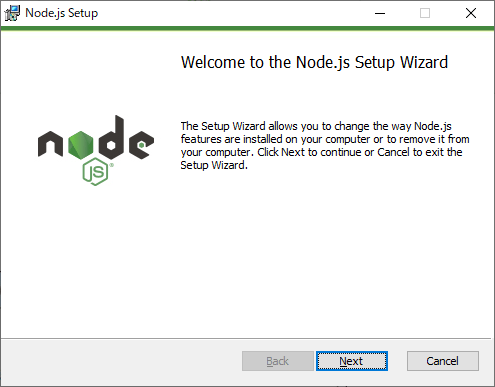

-  ［Next］押下


-  「Ｉ accept ･･･」にチェックを入れた後、［Next］押下


-  インストール先を確認し、［Next］押下


-  ［Next］押下


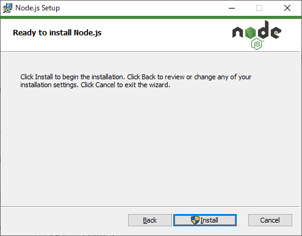

-  ［Install］押下


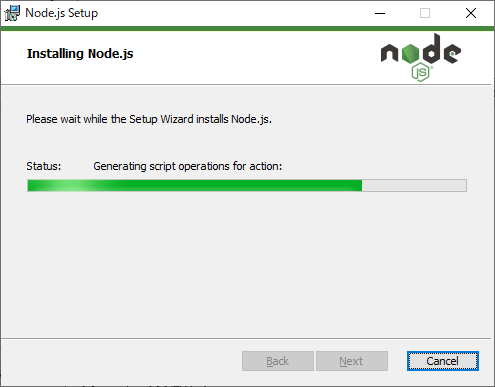

-  しばらく待つ


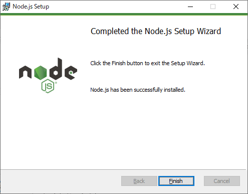

-  ［Finish］押下


### 再起動とバージョン確認

 インストールに伴い必要な環境変数が定義されるのでWindowsを再起動後、前項「Node.jsとNPMインストール済み確認」に従い、バージョンが正しく表示されることを確認する。


# YARNのインストール

 YARN（Yet Another Resource Negotiator）とは、NPMの高速版パッケージのようなもの

## YARNインストール済み確認

 コマンドプロンプトから以下のコマンドを実行し、バージョンが正しく表示されることを確認する。

```
> yarn --version
```

 バージョン表示で失敗する場合、以下インストールを実施する。

## YARNインストール

 YARN未インストール時に以下を実施する。

### インストーラの準備

 公式サイト（URL: [https://yarnpkg.com/ja/](https://yarnpkg.com/ja/)）よりWindows用インストーラ（.msi）をダウンロードする。


- ［YARNをインストール］押下


- 種類確認後、［インストーラをダウンロードする］押下


### インストーラ実行

 ダウンロードしたインストーラを実行する。


- ［Next］押下


- 「Ｉ accept ･･･」にチェックを入れた後、［Next］押下


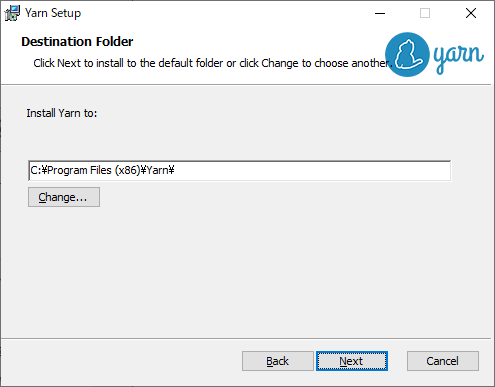

- インストール先を確認し、［Next］押下


- ［Install］押下


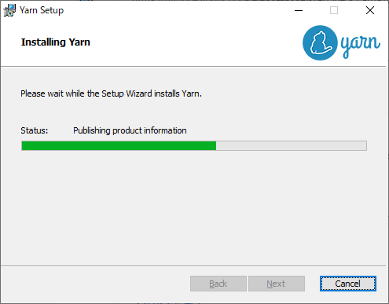

- しばらく待つ


- ［Finish］押下


### 再起動とバージョン確認

 インストールに伴い必要な環境変数が定義されるのでWindowsを再起動後、前項「YARNインストール済み確認」に従い、バージョンが正しく表示されることを確認する。


# 関連パッケージのインストール

 Synerex Alphaのインストール例と関連パッケージのインストール方法を記述する。インストール要否を判断し作業を行うこと。

## Synerex Alphaインストール

 コマンドプロンプトから以下のコマンドを実行し、Synerex Alphaをインストールする。

 （※以下はインストール例であるため、適宜調整する）

```
【サンプル1】
> mkdir c:\MyProjects
> cd c:\MyProjects
> git clone https://github.com/synerex/synerex_alpha

【サンプル2】
> go get -u github.com/synerex/synerex_alpha    ← %GOPATH%\src 配下へコピーする
```

| 【 Synerexリポジトリ例】          |
| --------------------------------- |
| github.com/synerex/synerex\_alpha |
| 上記フォーク先                    |


## 関連パッケージのインストール（参考）

 Synerex Alphaを実行するためには、関連パッケージのインストールが必要となる。

 通常は、go buildで関連パッケージを自動でダウンロードするが、go version 1.12以降では、go modulesパッケージ仕様が変更され、デフォルトでは、ビルド対象パッケージが %GOPATH%\src 配下にある場合、関連パッケージのダウンロードがされない。

 そのため、モジュールが見つからない旨のエラーが発生する場合は、go build前に以下コマンド実行するか、手動にて関連パッケージをインストールする必要がある。

### ダウンロード先

| ダウンロード種別 | ダウンロード先                                               |
| ---------------- | ------------------------------------------------------------ |
| 自動             | %GOPATH%\pkg\mod（%GOPATH%\srcにないモジュールを自動ダウンロード） |
| 手動             | %GOPATH\src                                                  |


### 自動ダウンロードする場合

 Synerex Alphaが動作するために必要な関連パッケージを自動インストールする。
（ビルド対象パッケージが %GOPATH%\src 配下に無い場合は不要）

  go buildコマンド発行前に、コマンドプロンプトから以下のコマンドを実行するか、環境変数「GO111MODULE」を設定する。

```
> set GO111MODULE=on
```

 以下buildサンプル

```
【サンプル1】
> cd %GOPATH%\src\github.com\synerex\synerex_alpha\cli\daemon
> set GO111MODULE=on
> go build               ← 正常終了すると「se-daemon.exe」が生成される 
> se-daemon build

【サンプル2】
> cd %GOPATH%\src\github.com\synerex\synerex_alpha\cli\daemon
> set GO111MODULE=on
> go mod init se-daemon  ← 正常終了すると「go.mod」が生成される
> go mod tidy            ← 正常終了すると「go.sum」が生成される
> go build               ← 正常終了すると「se-daemon.exe」が生成される 
```

 上記でビルドエラーになる場合は次項「手動ダウンロードする場合」を実行することで解決する場合がある。
 ※環境変数にて「GO111MODULE」を設定する方法については省略する。

### 手動ダウンロードする場合

 Synerex Alphaが動作するために必要な全関連パッケージを手動インストールする。

 コマンドプロンプトから以下のコマンドを実行する。

```
 【Synerex Alphaディレクトリ例】：%GOPATH%\src\github.com\synerex\synerex_alpha

> cd [Synerex Alphaディレクトリ]
> go get ./...
```

※1 ダウンロードに時間がかかるため気長に待つ。
※2 GO111MODULE=autoに伴うエラーが発生する場合は、前項「自動ダウンロードする場合」同様にsetコマンドにて対応する。


# その他

## 実行エラー時の対応

 「go run」「go build」等、実行時にパッケージなしエラーになる場合は、前項「関連パッケージのインストール」の他に、個別でパッケージをインストールすることも可能。

 【エラー例】


 内容：「github.com/spf13/viper」パッケージが見つからない

 【対策コマンド】

```
> go get -u github.com/spf13/viper
```

## go generateエラー

 go generateでエラーになる要因として、goパッケージの未インストール、パス不正の場合があるので、パスが正常に通っているか確認する。

 Protocのパス定義でinclude部分を参照する部品があるが、パス不正によるエラーとなる例があった。（Protocパスの設定見直しにて解決）。


## go buildエラー

 go buildでエラーになる要因として、go.modに問題がある場合があるので、内容が正しいことを確認する。

「go mod init」で初期化する方法でも対応可能。（前章「自動ダウンロードする場合【サンプル2】」参照※）
※モジュールバージョン管理の更新に注意


― 以上 ―
